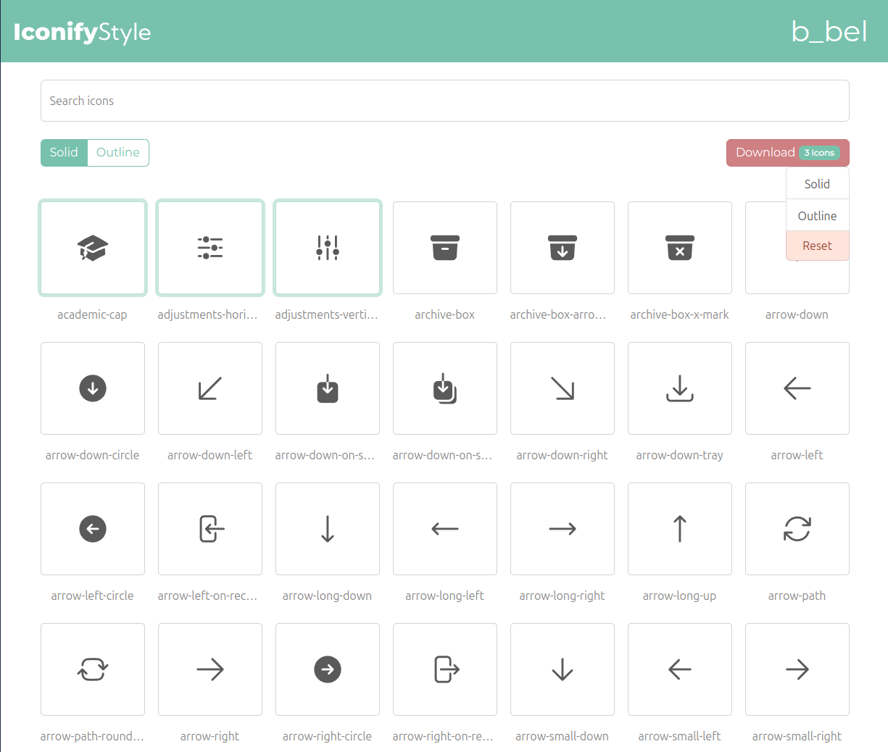

# IconifyStyle


## Présentation du projet

**IconifyStyle** est une application intuitive qui simplifie la sélection d'une ou plusieurs icônes issues du projet [Heroicons](https://github.com/tailwindlabs/heroicons). Elle permet d'exporter ces icônes dans un fichier CSS, que vous pouvez facilement intégrer dans vos projets. Il vous suffit d'utiliser une balise `<span>` avec une classe, de la même manière que pour FontAwesome, pour afficher vos icônes de manière élégante et efficace.

## Aperçu



## Fonctionnalités

- **Sélection d'icônes** : Choisissez parmi une vaste collection d'icônes.
- **Exportation facile** : Générez un fichier CSS prêt à l'emploi pour vos icônes.
- **Intégration simple** : Affichez vos icônes avec une balise `<span>` et des classes, comme avec FontAwesome.

## Utilisation

1. Sélectionnez les icônes que vous souhaitez utiliser.
2. Cliquez sur le bouton d'exportation pour générer le fichier CSS.
3. Incluez le fichier CSS dans votre projet et utilisez les classes correspondantes dans vos balises `<span>`.

### Exemple de fichier HTML

```html
<link rel="stylesheet" href="path/to/iconifystyle.css">
<span class="icon-example"></span>

```

### Format de données dans le fichier CSS

``` css
span.icon-example{
    content: url(
        'data:image/svg+xml;utf8,<svg xmlns="http://www.w3.org/2000/svg" viewBox="0 0 24 24" fill="currentColor" aria-hidden="true"><path d="M11.7 2.805a.75.75 0 01.6 0A60.65 60.65 0 0122.83 8.72a.75.75 0 01-.231 1.337 49.949 49.949 0 00-9.902 3.912l-.003.002-.34.18a.75.75 0 01-.707 0A50.009 50.009 0 007.5 12.174v"/></svg>'
    );
}
```

## Installation

1. Clonez le dépôt :

```bash
   git clone https://github.com/hardcodeur/IconifyStyle.git
```

2. Installer les dépendance :

```bash
    cd iconifystyle/App
    composer install
```

3. Lancer le projet :

```bash
    symfony server  
```

## Contribuer
Les contributions sont les bienvenues ! N'hésitez pas à soumettre des demandes de tirage (pull requests) ou à signaler des problèmes (issues).

## License
Ce projet est sous licence MIT.

## Author
